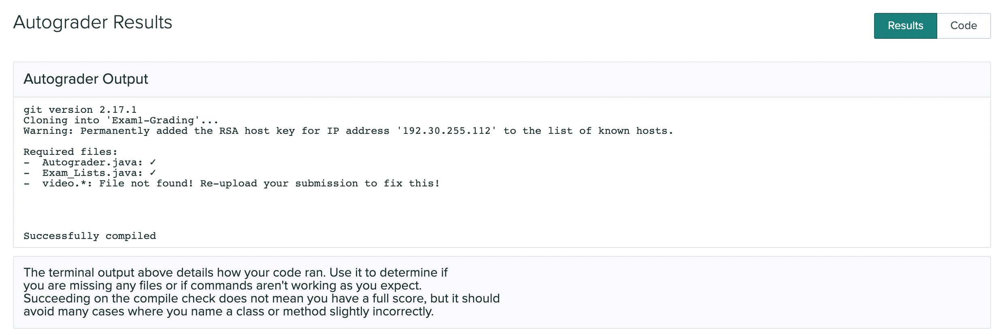

# Final Exam - Part 1

### Release: 8am PDT Tuesday June 7, 2022
### Due: 8am PDT Friday June 10, 2022

**We will not accept late submissions. There will be no exceptions.**

This page details a take-home exam that you will complete over the next few
days. You can’t communicate with anyone about the content of the assignment
until the exam has concluded. **DO NOT** post clarification or other similar questions as staff will not be answering these types of questions during this time period. If there are broken links or otherwise strange parts of the writeup, you may post these concerns on piazza. 

Do not use any online service other than Piazza to ask questions about the
exam. Do not search for, solicit, or use solutions to the problems that
you find elsewhere for the exam. These are all violations of academic integrity
that students have committed on exams like this in the past.

You can make use of any course notes, online resources about Java and its
libraries, Java tools, and so on to complete the exam, including re-using code
from class notes or PAs.

You can review the grading policy for exams in the [syllabus](https://ucsd-cse12-sp22.github.io/syllabus.html).
You will complete the programming task below and submit your work to the `Final Exam - Part 1` Gradescope assignment.

Starter code is available here:

[https://github.com/ucsd-cse12-sp22/cse12-final1-starter](https://github.com/ucsd-cse12-sp22/cse12-final1-starter)

Submission checklist (see long descriptions below for full details):

- [ ] `Warehouse.java`

Only submit your implementation of ``Warehouse``. Do not submit any more files or implementations. Additionally do not add any JUnit related code to this file. Doing so may cause the autograder to crash.

Make sure to look at your Gradescope submission after submitting to see if all the required files are there.


### **This task will be entirely autograded** 

Make sure that your submission passes autograder for your code to be properly graded. 

If you are having issues with getting the autograder to run successfully, you may find it helpful to consult the [Developing with the Gradescope Autograder in Mind](https://docs.google.com/document/d/1IKSDkG4kHC0gb2FyqdeOWJOAbQr6UCvYZSToIBopfVs/edit?usp=sharing) guide.

If your submission passes the autograder, then you should see output similar to:

{:width="100%"}

Be aware that the Compile check does not check for code correctness, but rather that your code compiles. Additionally, if your code errors or throws exceptions unexpectedly, the autograder will not grade your submission. This will result in 0 points being given for that particular task.

Your submission will be graded **once** you submit and you will see your score. You should test thoroughly yourself to make sure your program works as expected.

## Clarifications

**Can I use a Java feature/library/method that we haven't covered in class?**

Yes (unless otherwise specified), just make sure it doesn't break the autograder. The course staff is not responsible for fixing any submissions that fail the autograder during or after the exam. 

**Can we write more methods than specified?**

Yes, you can write additional helper methods.

**Can I use previous code that I wrote for a PA in my exam?**

Yes.


## Task 1 – Warehouse
A computer manufacturing and reselling company has asked you to create an order tracking system for their warehouse. The company requires a way of tracking their computer inventory and a way of getting, tracking, and fulfilling orders. 

This company will need to accept new orders that come into the warehouse. Each order will consist of a unique id, a status code, and the actual computer that is being ordered. Each unique id will be represented as a string, status codes will be represented as integers, and the actual product will be a `Computer` object. 

The company has defined the following status codes:

- 0: Rejected
- 1: Idle
- 2: Incomplete
- 3: Complete

The company has provided the following descriptions for each status code and the situations when each may occur

- 0: Status code for rejected order. When the customer attempts to make a new order that cannot be completed (model is not available, duplicate ids, garbage input). Additionally, orders may be rejected if they have already been made before or not in the idle state.
- 1: Status code for idle order. This is the default state of orders.
- 2: Status code for incomplete order. This may happen when the order was successfully made, but could not be fulfilled. This may happen if there is no longer any stock available by the time this order is being processed.
- 3: Status code for complete order. This may happen when the order was successfully made and the order was successfully fulfilled.

The company has provided the following code requirements: 

```java
interface Inventory {
    boolean makeNewOrder(Order o);
    int trackOrder(String id);
    boolean fulfillNextOrder();
}
```

### Below are the descriptions for the required methods:

**Inventory Interface**

``boolean makeNewOrder(Order o)``: The warehouse will recognize that a new order has been made and will attempt to add the new order to a list of pending orders. If the order is null, already exists in the list or the id is a duplicate, reject the order (i.e. return false). In this case, do not modify the status or add it to the list of pending orders (i.e. nothing needs to be done with the order). If the order cannot be completed because the warehouse does not carry the requested model or the there is no more stock of the requested model, reject the order, set the status to `0` (rejected) and add it to the list of pending orders. If there are no issues with the order, then set the status of the order to `1` (idle) and add it to the list of pending orders. Return true only if there were no issues with the order and the order was added to the list of pending orders with a status code of `1`, return false otherwise. Additionally set the order status appropriately if there were issues with the order.

``int trackOrder(String id)``: The warehouse will return the status code for the particular Order with the corresponding id. This order may be in any of the four states. If the order corresponding with the id cannot be found or otherwise cannot be retrieved, return -1.

``boolean fulfillNextOrder()``: The warehouse will attempt to fulfill the next idle order, following FIFO order. Return true if the order was successfully fulfilled, false otherwise. The status code of the order and inventory count should be updated appropriately. However, the order should not be removed from the list.

**Warehouse Class**

The ``Warehouse`` class will implement the ``Inventory`` interface and will have a constructor that takes ``Computer[]`` and ``int[]`` as arguments. The `Computer[]` will contain all the available models that the warehouse carries. The `int[]` will contain the amount of stock for each model. Corresponding indices relate to each other.

```java
Ex:

[Macbook, Windows, Linux]
[   2   ,    3   ,   4  ]

2 Macbooks, 3 Windows, 4 Linux
```

---

### Below are the descriptions for additional objects and methods.

**NOTE: You do not need to write implementations for the following code definitions. Correct implementations will be provided by the autograder. However, it is recommended to write these implementations so you can test locally.** 

```java
interface Computer {
    // Returns the model name of the computer as a string
    String getModel();
}

class Order {
    // Returns the Id of this order
    String getId();

    // Returns the status code of this order
    int getStatus();

    // Sets the status code of this order
    void setStatus(int status);

    // Returns the Computer of this order
    Computer getProduct();
}
```
