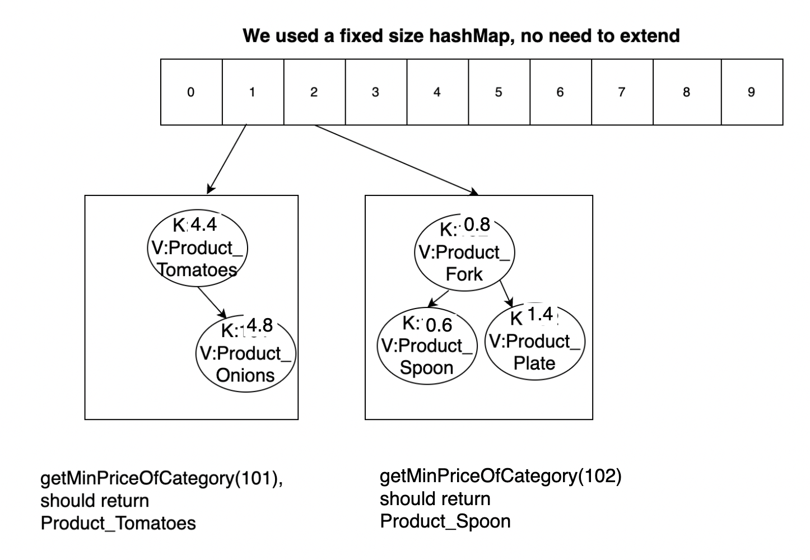

# Final Exam - Part 3

### Release: 8am PDT Tuesday June 7, 2022
### Due: 8am PDT Friday June 10, 2022

**We will not accept late submissions. There will be no exceptions.**

This page details a take-home exam that you will complete over the next few
days. You can’t communicate with anyone about the content of the assignment
until the exam has concluded. **DO NOT** post clarification or other similar questions as staff will not be answering these types of questions during this time period. If there are broken links or otherwise strange parts of the writeup, you may post these concerns on piazza. 

Do not use any online service other than Piazza to ask questions about the
exam. Do not search for, solicit, or use solutions to the problems that
you find elsewhere for the exam. These are all violations of academic integrity
that students have committed on exams like this in the past.

You can make use of any course notes, online resources about Java and its
libraries, Java tools, and so on to complete the exam, including re-using code
from class notes or PAs.

You can review the grading policy for exams in the [syllabus](https://ucsd-cse12-sp22.github.io/syllabus.html).
You will complete the programming task below and submit your work to the `Final Exam - Part 3` Gradescope assignment.

Starter code is available here:

[https://github.com/ucsd-cse12-sp22/cse12-final3-starter](https://github.com/ucsd-cse12-sp22/cse12-final3-starter)

Submission checklist (see long descriptions below for full details):

- [ ] `BST.java`
- [ ] `MyHashMap.java`
- [ ] `CircularArrayList.java`
- [ ] `FileReader.java`

Make sure to look at your Gradescope submission after submitting to see if all the required files are there.

### **Task 1 and 2 will be be entirely autograded.** 

Make sure that your submission passes autograder for your code to be properly graded. 

If you are having issues with getting the autograder to run successfully, you may find it helpful to consult the [Developing with the Gradescope Autograder in Mind](https://docs.google.com/document/d/1IKSDkG4kHC0gb2FyqdeOWJOAbQr6UCvYZSToIBopfVs/edit?usp=sharing) guide.

Be aware that the Compile check does not check for code correctness, but rather that your code compiles. Additionally, if your code errors or throws exceptions unexpectedly, the autograder will not grade your submission. This will result in 0 points being given for that particular task.

Your submission will be graded **once** you submit and you will see your score. You should test thoroughly yourself to make sure your program works as expected.

## Clarifications

**Can I use a Java feature/library/method that we haven't covered in class?**

Yes (unless otherwise specified), just make sure it doesn't break the autograder. The course staff is not responsible for fixing any submissions that fail the autograder during or after the exam. 

**Can we write more methods than specified?**

Yes, you can write additional helper methods.

**Can I use previous code that I wrote for a PA in my exam?**

Yes.


## Task 1 – BST and HashMap

You will be given set of student details. (Sample in `input.txt`). The product class is given for you. Each product has a name, category and price (in dollars) details.
We want to store the product details in a HashMap, such that all products in the same category fall in the same bucket. Further, we want to find out the price of the most affordable product in each category. It is an interesting idea to use BST for each bucket(category), so that you can easily retrieve the minimum. You will be implementing this functionality in this task.

You will be writing your code in `BST.java`, `MyHashMap.java` and `FileReader.java `. The `MyHashMap.java` will be implementation of your hashMap that implements the given `DefaultMap` interface given. 

You have used ArrayList and heaps earlier for the buckets in HashMap. Now you will be creating every bucket using the BST datatstructure. For this you are first required to complete the methods in the `BST.java`. These methods can be used in coding your HashMap buckets.

### Task 1.1 BST add, smallest, removeMinimum, toArray, isEmpty
You will implement 5 methods in `BST.java`, these can further use other helper methods.

The `add` method will take in the key and value values and add them to the BST. Make sure the BST property is satisfied after adding each element.

The `smallest` method will return the minimum element of your BST, this does not remove the element.

The `removeMinimum` method will remove and return the minimum element of your BST. Make sure the BST property is satisfied after removing each element.

The `toArray` method will return the elements in the BST in inorder sorted order.

The `isEmpty` method will return true if the BST is empty, false otherwise.

The HashMap and BST constructors also takes a comparator, which can be used to compare the elements. Further details can be infered from the starter code.

### Task 1.2 FileInputStream
The `FileReader.java` class is used to read the product details.
You will implement 2 methods in `FileReader.java`, these can further use other helper methods.

The `createHeap` method will read in the product details from the `input.txt` file and store the product entries in the HashMap. Use java FileInputStream to read the file. (More help in starter code)

The `getMinPriceOfCategory` method will return a product with the minimum price in a given category. If the category is not present, then return null.

Make sure to define a HashMap object in your FileReader constructor.

### Task 1.3 HashMap
You are required to implement the DefaultMap interface methods in the `MyHashMap.java`. It is similar to PA6, but you are required to use a BST instead of ArrayList for the buckets. 

Make sure to write proper hashFunction to map the Product to the bucket (category of the product - 100). Hash function example: for Product(Tea,101,4.9), the bucket is 1 i.e (101 - 100). The categories are integers and will start from 101.

You are not required to implement rehash functionality for this Exam. You can consider a fixed size HashMap of around 10 buckets, as the number of categories is limited. So loadfactor is not needed for the exam.

You further have a `HashMapTest` file that can be used to test your code locally. You do not need to submit the test file.

For example, we have a file where each line contains `Product,Category,Price`: 

```
Tomatoes,101,4.4
Onions,101,4.8
Fork,102,0.8
Spoon,102,0.6
Plate,102,1.4
```

Then, the data structure would appear as follows
{:width="100%"}

## Task 2 - CircularArrayList and Iterator
You will be completing a circular arraylist implementation and implementing an iterator. Do not change the names or types of any of the fields or methods in the `CircularArrayList` class in the starter code. You can add more fields and methods if you need to.

### Task 2.1
You will be writing your code in the file called `CircularArrayList.java`. 

Implement the `insert` method from ArrayListADT interface and the `expandCapacity` method. 

The `insert` method will add the given element at a specified position. Make sure that the insertion happens in place i.e. in the same array and do not return a new array. Insertion position is always between 0 and size of the list. 

You are also required to implement the `expandCapacity` method for the circularArrayList. Start with an initalCapacity of 2, and double everytime expandCapacity is called.

### Task 2.2 Iterator
You will need to create a `CircularArrayListIterator` class within the  `CircularArrayList.java`. This is an iterator for your circular arraylist starting from the start of the list. 

Implement the iterator given in the starter code.

